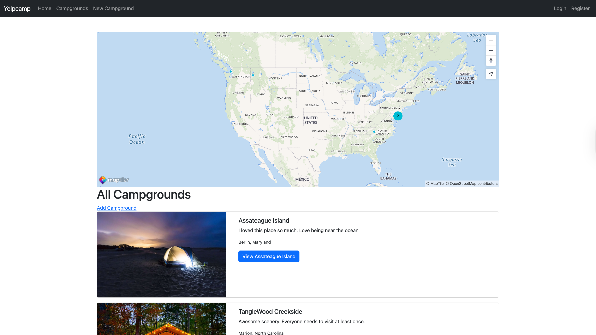
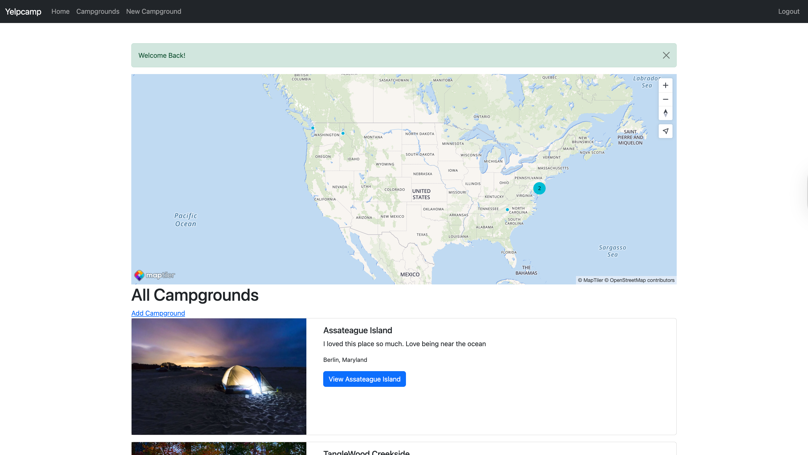
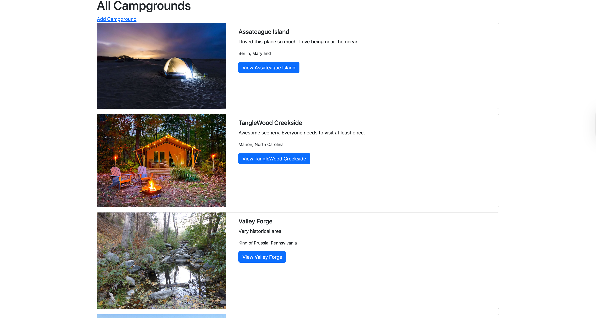
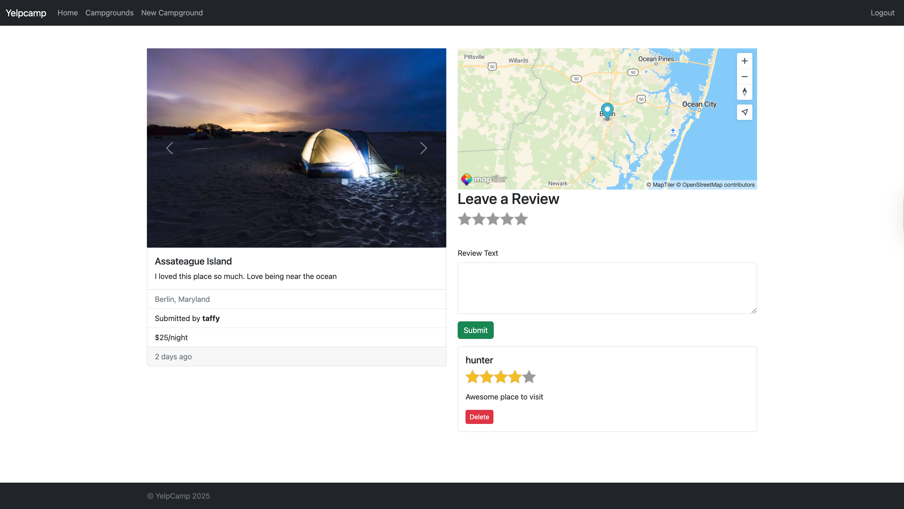
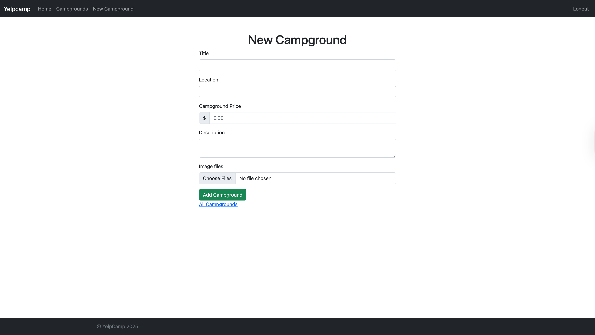
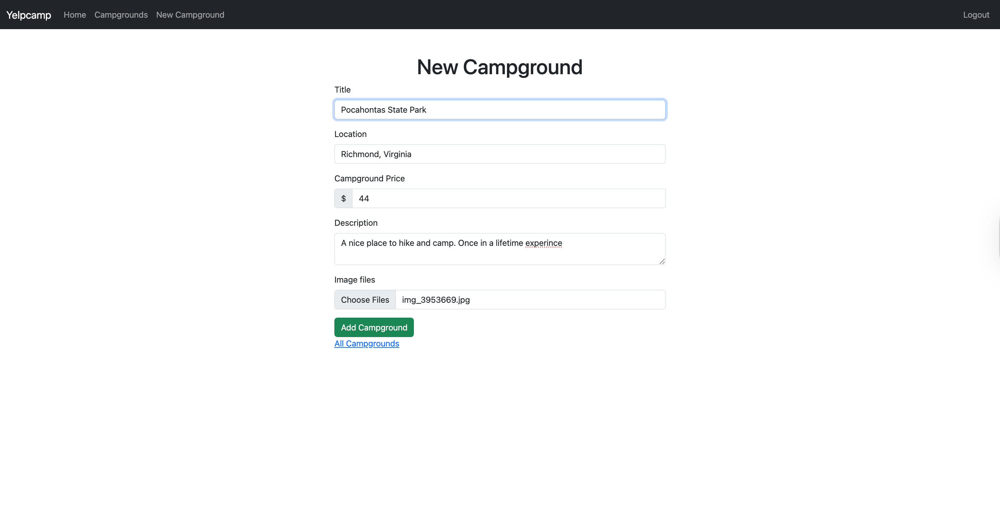
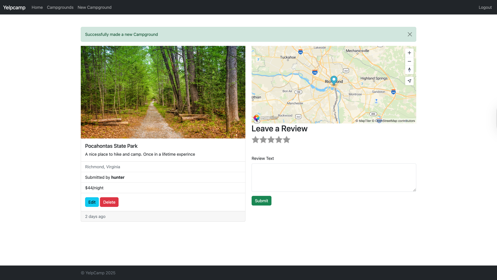
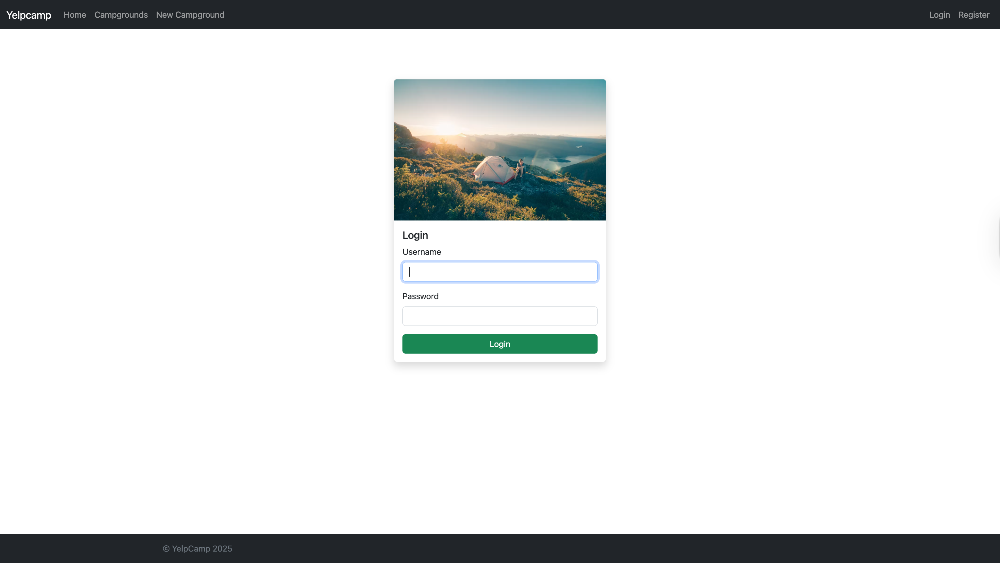
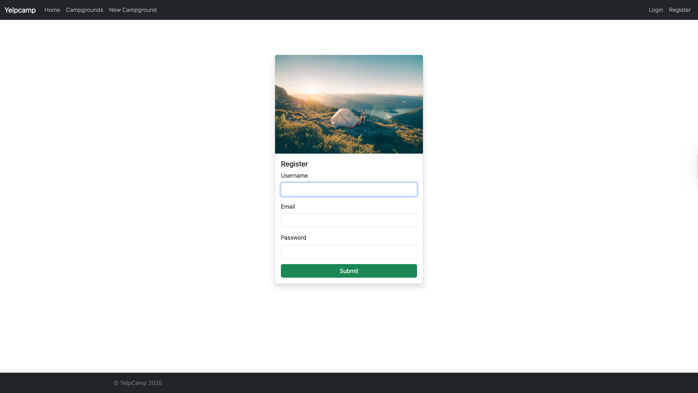

# YelpCamp 🏕️

**A full-stack campground review application built with Node.js, Express, MongoDB (Mongoose), EJS, Passport.js, Cloudinary, and Mapbox.**

---

## 🌟 Live Demo

YelpCamp(https://yelpcamp-kmmn.onrender.com/)

---

## 📌 Overview

YelpCamp allows users to browse, create, and review campgrounds across the globe. It features user authentication, image uploads, mapping of campground locations, and secure session-based operations :contentReference[oaicite:1]{index=1}.

---

## 🧰 Tech Stack

- **Backend:** Node.js, Express.js, Mongoose (MongoDB), Passport for authentication
- **Frontend:** EJS templating, Bootstrap (or your custom CSS), JavaScript
- **User Features:** CRUD for campgrounds and reviews, user authorization with session handling
- **Additional Services:**
  - **Cloudinary** — for image storage and handling
  - **Mapbox API** — to render interactive maps for campground locations :contentReference[oaicite:2]{index=2}

---

## ✨ Key Features

- **Authentication & Authorization:** Signup, login, secure password hashing using Passport, ownership checks for editing/deleting content
- **Campgrounds CRUD:** Add, edit, and remove campgrounds (images, details, location, author)
- **Reviews & Ratings:** Leave feedback, and edit or delete reviews if you're the author
- **Image Handling:** Upload campground images to Cloudinary via multer
- **Geolocation:** Display campgrounds with Mapbox maps and address geocoding
- **User Experience:** Flash messages, form validation, responsive design, and data sanitization for security

---

## 📥 Installation & Setup

```bash
# Clone repo
git clone https://github.com/RunyararoMucheche/Yelpcamp.git
cd Yelpcamp

# Install dependencies
npm install

# Set up environment variables (create a `.env` file)
CLOUDINARY_CLOUD_NAME=your_cloudinary_name
CLOUDINARY_KEY=your_cloudinary_key
CLOUDINARY_SECRET=your_cloudinary_secret
MAPBOX_TOKEN=your_mapbox_token
SESSION_SECRET=yourSessionSecret
MONGODB_URI=your_mongo_uri

# Run the app in development
npm run dev
```

## 📷 Screenshots












## 🙋‍♂️ About the Author

**Runyararo Mucheche**

- GitHub: [RunyararoMucheche](https://github.com/RunyararoMucheche)
- Upwork Portfolio: [Runyararo Mucheche](https://www.upwork.com/freelancers/~013a0b5a6014152ba5)
- LinkedIn: [Runyararo Mucheche](https://www.linkedin.com/in/runya-mucheche/)
